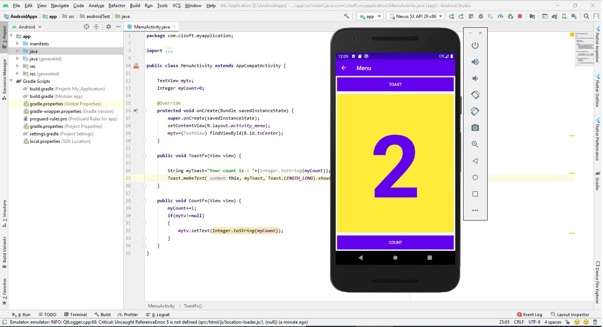
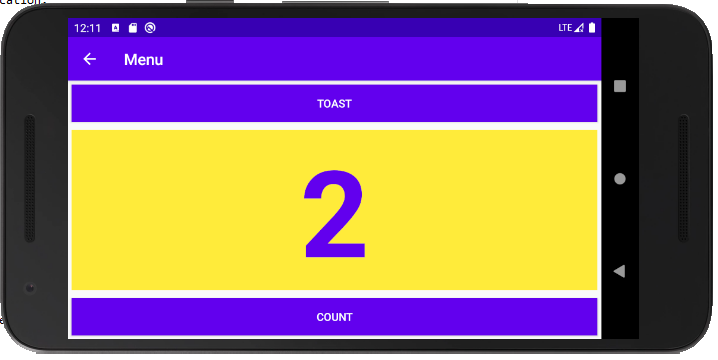
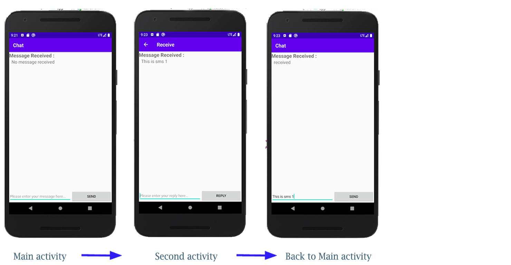
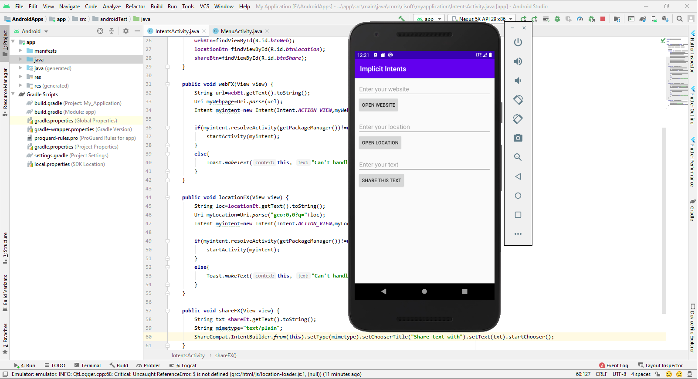

# Codelabs Exercises
## Exercise 1
This is getting started with android in android studio

## Exercise 2
Added count and toast functionality on App.

Added orientation functionality to App.

## Exercise 3
Added intent functionality with putExtra/getExtra features on App.

## Exercise 4
Added intent functionality with ability to start other Apps which supports certain type of data.

